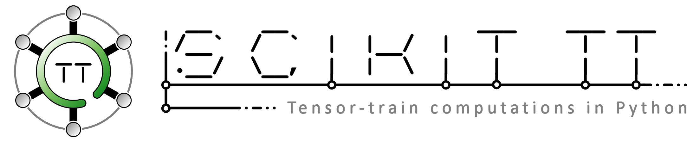

<p align="center">
  <a href="https://travis-ci.org/PGelss/scikit_tt"><a>
  <a href="https://codecov.io/gh/PGelss/scikit_tt/branch/master"><a>
</p>

## Short description

The simulation and analysis of high-dimensional problems is often infeasible due to the curse of dimensionality. Using the *tensor-train format* (TT format) [[1](README.md#11-references), [2](README.md#11-references)], **scikit-tt** can be applied to various numerical problems in order to reduce the memory consumption and the computational costs compared to classical approaches significantly. Possible application areas are the computation of low-rank approximations for high-dimensional systems [[3](README.md#11-references)], solving systems of linear equations and eigenvalue problems in the TT format [[4](README.md#11-references)], representing operators based on nearest-neighbor interactions in the TT format [[5](README.md#11-references)], constructing pseudoinverses for tensor-based reformulations of dimensionality reduction methods [[6](README.md#11-references)], and the approximation of transfer operators [[2](README.md#11-references)] as well as governing equations of dynamical systems [[7](README.md#11-references)].

## Content

1. [Installing](README.md#1-installing)
2. [TT class](README.md#2-tt-class) 
3. [TT solvers](README.md#3-tt-solvers)
   - [Systems of linear equations](README.md#31-systems-of-linear-equations)
   - [Generalized eigenvalue problems](README.md#32-generalized-eigenvalue-problems)
   - [Linear differential equations](README.md#33-linear-differential-equations)
4. [SLIM decomposition](README.md#4-slim-decomposition)
5. [Data analysis](README.md#5-data-analysis)
   - [Tensor-based dynamic mode decomposition (tDMD)](README.md#51-tensor-based-dynamic-mode-decomposition-tdmd)
   - [Transformed data tensors](README.md#52-transformed-data-tensors)
   - [Multidimensional approximation of nonlinear dynamical systems (MANDy)](README.md#53-multidimensional-approximation-of-nonlinear-dynamical-systems-mandy)
   - [Tensor-based extended dynamic mode decomposition (tEDMD)](README.md#54-tensor-based-extended-dynamic-mode-decomposition-tedmd)
   - [Ulam's method](README.md#55-ulams-method)
6. [Models](README.md#6-models)
7. [Examples](README.md#7-examples)
8. [Tests](README.md#8-tests)
9. [Utilities](README.md#9-utilities)
10. [Additional information](README.md#10-additional-information)
    - [Authors & contact](README.md#101-authors--contact)
    - [Built with](README.md#102-built-with)
    - [License](README.md#103-license)
    - [Versions](README.md#104-versions)
11. [References](README.md#11-references)

## 1. Installing

A [*setup.py*](setup.py) is included in the package. To install **scikit-tt** simply enter:

```
python setup.py install --user
```

or install the latest version directly from GitHub:

```
pip install git+https://github.com/PGelss/scikit_tt
```

## 2. TT class

The tensor-train class - implemented in the module [*tensor-train.py*](scikit_tt/tensor_train.py) - is the core of **scikit-tt** and enables us to work with the tensor-train format. We define tensor trains in terms of different attributes such as *order*, *row_dims*, *col_dims*, *ranks*, and *cores*. An overview of the member functions of the class is shown in the following list.

```
TT ....................... construct tensor train from array or list of cores
print .................... print the attributes of a given tensor train
+,-,*,@ .................. basic operations on tensor trains 
transpose ................ transpose of a tensor train
isoperator ............... check if a tensor train is an operator
copy ..................... deep copy of a tensor train
element .................. compute single element of a tensor train
full ..................... convert a tensor train to full format
matricize ................ matricize a tensor train
ortho_left ............... left-orthonormalize a tensor train
ortho_right .............. right-orthonormalize a tensor train
ortho .................... left- and right-orthonormalize a tensor train
norm ..................... compute the norm of a tensor train
tt2qtt ................... convert from TT to QTT format
qtt2tt ................... convert from QTT to TT format
pinv ..................... compute pseudoinverses of tensor trains
```

Further functions defined in [*tensor_train.py*](scikit_tt/tensor_train.py) are:

```
zeros .................... construct a tensor train of all zeros
ones ..................... construct a tensor train of all ones
eye ...................... construct an identity tensor train
rand ..................... construct a random tensor train
unit ..................... construct a canonical unit tensor train
uniform .................. construct a uniformly distributed tensor train
```

## 3. TT solvers

Different methods for solving systems of linear equations, eigenvalue problems, and linear differential equations in the TT format are implemented in **scikit-tt**. These methods - which can be found in the directory [*scikit_tt/solvers*](scikit_tt/solvers) - are based on the alternating optimization of the TT cores.

### 3.1 Systems of linear equations

In order to approximate the solution of a system of linear equations in the TT format, a series of low-dimensional problems can be solved by fixing certain components of the tensor network. For this purpose, the *alternating linear scheme* (ALS) and the *modified alternating linear scheme* (MALS) [[3](README.md#11-references)] are implemented in [*sle.py*](scikit_tt/solvers/sle.py).

```
als ...................... alternating linear scheme for systems of linear equations in the TT format
mals ..................... modified ALS for systems of linear equations in the TT format
```

### 3.2 Generalized eigenvalue problems

Besides power iteration methods [[8](README.md#11-references)], ALS and MALS can also be used to find approximations of eigenvalues and corresponding eigentensors of TT operators. The basic procedures of ALS and MALS - implemented in [*evp.py*](scikit_tt/solvers/evp.py) - for (generalized) eigenvalue problems are similar to the ones for systems of linear equations. The main difference is the type of optimization problem which has to be solved in the iteration steps. See [[3](README.md#11-references)] for details.

```
als ...................... ALS for generalized eigenvalue problems in the TT format
power_method ............. inverse power iteration method for eigenvalue problems in the TT format
```

### 3.3 Linear differential equations

In order to compute time-dependent or stationary distributions of linear differential equations in the TT format, **scikit-tt** uses explicit as well as implicit integration schemes such as the Euler methods or the trapezoidal rule. In order to approximate the solutions at each time step using implicit methods, ALS and MALS, respectively, are used. The methods can be found in [*ode.py*](scikit_tt/solvers/ode.py).

```
explicit_euler ........... explicit Euler method for linear differential equations in the TT format
errors_expl_euler ........ compute approximation errors of the explicit Euler method
implicit_euler ........... implicit Euler method for linear differential equations in the TT format
errors_impl_euler ........ compute approximation errors of the implicit Euler method
trapezoidal_rule ......... trapezoidal rule for linear differential equations in the TT format
errors_trapezoidal ....... compute approximation errors of the trapezoidal rule
adaptive_step_size ....... adaptive step size method for linear differential equations in the TT format
```

## 4. SLIM decomposition

The SLIM decomposition is a specific form of TT decompositions which represent tensors networks with a certain structure. For instance, tensor operators corresponding to nearest-neighbor interaction systems can be systematicly decomposed into a tensor-train operator using the algorithms in [*slim.py*](scikit_tt/slim.py). See [[5](README.md#11-references)] for details.

```
slim_mme ................. SLIM decomposition for Markov generators
slim_mme_hom ............. SLIM decomposition for homogeneous Markov generators
```

## 5. Data analysis

**scikit-tt** combines data-driven methods with tensor network decompositions in order to significantly reduce the computational costs and/or storage consumption for high-dimensional data sets. Different methods can be found in the directory [*scikit_tt/data_driven*](scikit_tt/data_driven/).

### 5.1 Tensor-based dynamic mode decomposition (tDMD)

tDMD is an extension of the classical dynamic mode decomposition which exploits the TT format to compute DMD modes and eigenvalues. The algorithms below can be found in [*tdmd.py*](scikit_tt/data_driven/tdmd.py). See [[6](README.md#11-references)] for details.

```
tdmd_exact ............... exact tDMD algorithm
tdmd_standard ............ standard tDMD algorithm
```

### 5.2 Transformed data tensors

Given time-series data and a set of basis functions, **scikit-tt** provides methods to construct the counterparts of tranformed basis matrices, so-called transformed data tensors. The algorithms in [*transform.py*](scikit_tt/data_driven/transform.py) include general basis decompositions [[10](README.md#11-references)], coordinate- and function-major decompositions [[7](README.md#11-references)], as well as an approach to construct transformed data tensors using higher-order CUR decompositions (HOCUR) [[10, 11](README.md#11-references)]. Furthermore, different basis functions which are typicall used can be found in the module.

```
constant_function ........ constant function
indicator_function ....... indicator function
gauss_function ........... Gauss function
periodic_gauss_function .. periodic Gauss function
basis_decomposition ...... construct general transformed data tensors
coordinate_major ......... construct transformed data tensors with coordinate-major basis
function_major ........... construct transformed data tensors with function-major basis
hocur .................... construct general transformed data tensors using HOCUR
```

### 5.3 Multidimensional approximation of nonlinear dynamical systems (MANDy)

MANDy combines the data-driven recovery of dynamical systems with tensor decompositions. The methods implemented in [*mandy.py*](scikit_tt/data_driven/mandy.py) can be used for the recovery of unknown governing equations from measurement data only. See [[7](README.md#11-references)] for details. 

```
mandy_cm ................. MANDy using coordinate-major decompositions
mandy_fm ................. MANDy using function-major decompositions
```

### 5.4 Tensor-based extended dynamic mode decomposition (tEDMD)

As described in [[10](README.md#11-references)], a tensor-based counterpart of EDMD is implemented in **scikit-tt**. The basic procedures of tEDMD - combinations of the TT format and so-called AMUSE - are implemented in [*tedmd.py*](scikit_tt/data_driven/tedmd.py).

```
amuset_hosvd ............. tEDMD using AMUSEt with HOSVD
amuset_hocur ............. tEDMD using AMUSEt with HOCUR
```

### 5.5 Ulam's method

Given transitions of particles in a 2- or 3-dimensional potentials, **scikit-tt** can be used to approximate the corresponding Perron-Frobenius operator in TT format. The algorithms can be found in [*ulam.py*](scikit_tt/data_driven/ulam.py). See [[2](README.md#11-references)] for details.

```
ulam_2d .................. approximate Perron-Frobenius operators for 2-dimensional systems
ulam_3d .................. approximate Perron-Frobenius operators for 3-dimensional systems
```

## 6. Models

The construction of several models from various fields such as heterogeneous catalysis [[3](README.md#11-references)], chemical reaction networks [[2](README.md#11-references)], and fractal geometry [[9](README.md#11-references)] is included in [*models.py*](scikit_tt/models.py). 

```
cantor_dust .............. generalization of the Cantor set and the Cantor dust
co_oxidation ............. CO oxidation on a RuO2 surface
fpu_coefficients ......... coefficient tensor for the Fermi-Pasta_ulam problem
kuramoto_coefficients .... coefficient tensor for the kuramoto model
multisponge .............. generalization of the Sierpinski carpet and the Menger sponge
rgb_fractal .............. generate RGB fractals
signaling_cascade ........ cascading process on a genetic network
toll_station ............. queuing problem at a toll station
two_step_destruction ..... two-step mechanism for the destruction of molecules
vicsek_fractal ........... generalization of the Vicsek fractal
```

## 7. Examples

Numerical experiments from different application areas are included in **scikit-tt**. For instance, the application of the TT format to chemical master equations [[2](README.md#11-references)], heterogeneous catalytic processes [[3](README.md#11-references)], fluid dynamics [[6](README.md#11-references)], and dynamical systems [[6](README.md#11-references), [7](README.md#11-references)] can be found in the directory [*examples*](examples/).

```
co_oxidation ............. compute stationary distributions of a catalytic process
fermi_pasta_ulam_1 ....... apply MANDy to the Fermi-Pasta-Ulam problem
fermi_pasta_ulam_2 ....... apply MANDy to the Fermi-Pasta-Ulam problem
fractals ................. use tensor decompositions for generating fractal patterns
karman ................... apply tDMD to the von Kármán vortex street
kuramoto ................. apply MANDy to the Kuramoto model
quadruple_well ........... approximate eigenfunctions of the Perron-Frobenius operator in 3D
signaling_cascade ........ compute mean concentrations of a 20-dimensional signaling cascade
triple_well .............. approximate eigenfunctions of the Perron-Frobenius operator in 2D
two_step_destruction ..... apply QTT and MALS to a two-step destruction process
```

## 8. Tests

Modules containing unit tests are provided in the directory [*tests*](tests/).

```
test_evp ................. unit tests for solvers/evp.py
test_mandy ............... unit tests for data_driven/mandy.py
test_ode ................. unit tests for solvers/ode.py
test_sle ................. unit tests for solvers/sle.py
test_slim ................ unit tests for slim.py
test_tdmd ................ unit tests for data_driven/tdmd.py
test_tensor_train ........ unit tests for tensor_train.py
test_ulam ................ unit tests for data_driven/ulam.py
```

## 9. Utilities

In [*utils.py*](scikit_tt/utils.py) we collect routines which are employed at several points in **scikit-tt**.

```
header ................... ASCII header for scikit-tt
progress ................. show progress in percent
timer .................... measure CPU time
```

## 10. Additional information

### 10.1 Authors & contact

* **Dr. Patrick Gelß** - _major contribution_ - CRC 1114, Freie Universität Berlin, Germany
  - address: Arnimallee 9, 14195 Berlin, Germany
  - email: p.gelss@fu-berlin.de
* **Dr. Stefan Klus** - _initial work_ - CRC 1114, Freie Universität Berlin, Germany
* **Martin Scherer** - _development advisor_ - Computational Molecular Biology, Freie Universität Berlin, Germany
* **Dr. Feliks Nüske** - _development of tEDMD_ - Department of Chemistry, Rice University, Houston, Texas

### 10.2 Built with

* [PyCharm](https://www.jetbrains.com/pycharm/)

### 10.3 License

This project is licensed under the [LGPLv3+](https://www.gnu.org/licenses/lgpl-3.0.en.html) license - see [LICENSE.txt](LICENSE.txt) for details.

### 10.4 Versions

The current version of **scikit-tt** is [1.0.1](https://github.com/PGelss/scikit_tt/releases/latest).

## 11. References

[1] I. V. Oseledets, "Tensor-Train Decomposition", SIAM Journal on Scientific Computing 33 (5) (2011)

[2] P. Gelß. "The Tensor-Train Format and Its Applications: Modeling and Analysis of Chemical Reaction Networks, Catalytic Processes, Fluid Flows, and Brownian Dynamics", Freie Universität Berlin (2017)

[3] P. Gelß, S. Matera, C. Schütte, "Solving the Master Equation without Kinetic Monte Carlo: Tensor Train Approximations for a CO Oxidation Model", Journal of Computational Physics 314 (2016)

[4] S. Holtz, T. Rohwedder, R. Schneider, "The Alternating Linear Scheme for Tensor Optimization in the Tensor Train Format", SIAM Journal on Scientific Computing 34 (2) (2012)

[5] P. Gelß, S. Klus, S. Matera, C. Schütte, "Nearest-Neighbor Interaction Systems in the Tensor-Train Format", Journal of Computational Physics 341 (2017)

[6] S. Klus, P. Gelß, S. Peitz, C. Schütte, "Tensor-based Dynamic Mode Decomposition", Nonlinearity 31 (7) (2018)

[7] P. Gelß, S. Klus, J. Eisert, C. Schütte, "Multidimensional Approximation of Nonlinear Dynamical Systems", Journal of Computational and Nonlinear Dynamics, 14 (6) (2019)

[8] S. Klus, C. Schütte, "Towards tensor-based methods for the numerical approximation of the Perron-Frobenius and Koopman operator", Journal of Computational Dynamics 3 (2), 2016

[9] P. Gelß, C. Schütte, "Tensor-generated fractals: Using tensor decompositions for creating self-similar patterns", arXiv:1812.00814 (2018)

[10] F. Nüske, P. Gelß, S. Klus, C. Clementi, "Tensor-based EDMD for the Koopman analysis of high-dimensional systems", arXiv:1908.04741 (2019)

[11] I. Oseledets, E. Tyrtyshnikov, "TT-cross approximation for multidimensional arrays", Linear Algebra and its Applications 432 (1) (2010)
